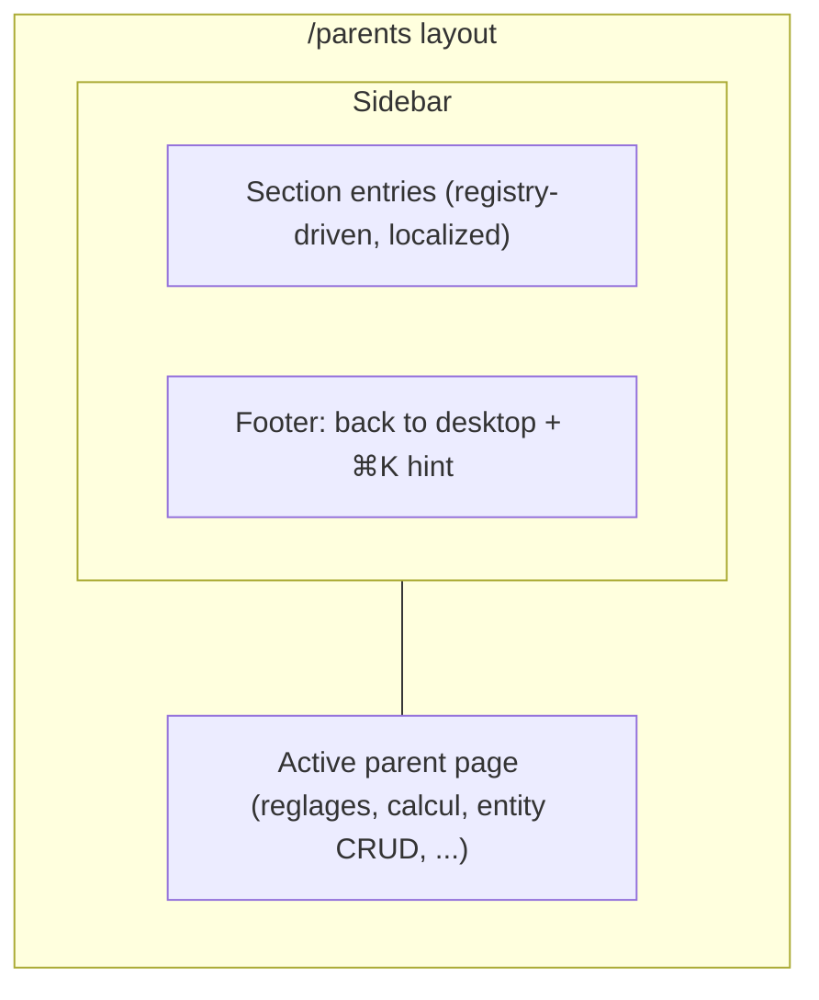
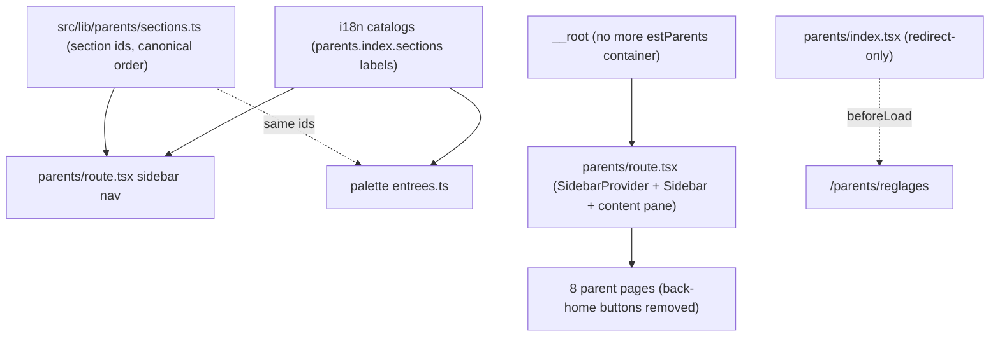

# Parents Section Sidebar Shell - Plan

## Goal Capsule

- **Objective:** Give the whole /parents section a shadcn Sidebar as its navigation shell — a full, proper install — and retire the card hub in favor of it.
- **Product authority:** Scope settled in dialogue on 2026-07-31; the child-facing bureau layer and the ⌘K palette are explicitly not active scope. The Product Contract below is canonical for product behavior; the Planning Contract for implementation mechanism.
- **Open blockers:** None. Work starts from `main` at the PR #28 merge (`dc911b3`), already pulled.
- **Stop conditions:** Stop and surface rather than guess if a golden test pins something this plan did not anticipate, or if the base-nova sidebar registry item diverges materially from the verified shape in Sources.

---

## Product Contract

### Summary

Install shadcn's Sidebar for real — `components.json`, the CLI, and the component's full dependency set — themed to the calm palette, and mount it as the first shared layout of the /parents section. The sidebar becomes the single navigation across all eight parent pages; the emoji-card hub retires and `/parents` redirects into the section.

### Key Decisions

- **Full shadcn install over cherry-picked vendoring** (session-settled: user-directed — chosen over hand-vendoring another extract: the real component with its whole dependency chain, managed by the CLI). Governs R1, R2.
- **One sidebar shell for the whole /parents section** (session-settled: user-directed — chosen over a settings-only sub-nav inside /parents/reglages: one navigation grammar for the parent space). Governs R5, R6.
- **Retire the card hub; `/parents` redirects** (session-settled: user-directed — chosen over keeping or repurposing the card grid: one navigation to maintain). Governs R8, R9.
- **Base UI flavor, matching the existing vendored components** (session-settled: user-approved — chosen over the canonical Radix-based shadcn sidebar: `command.tsx`/`dialog.tsx` already come from the base-nova registry on `@base-ui/react`; one primitive library in the app). Governs R1, R2.
- **Redirect target is `/parents/reglages`** (session-settled: user-approved — the user frames this space as the settings section). Governs R8.
- **The ⌘K hint moves to the sidebar footer** (session-settled: user-approved — the retiring hub is the only place `palette.indice` renders today). Governs R9.
- **Mobile gets shadcn's off-canvas sheet behind a trigger** (session-settled: user-approved — the stock behavior is acceptable for a parent-only area). Governs R7.

### Requirements

**Installation and theming**

- R1. The repo gains a `components.json` and shadcn CLI setup targeting the same registry family as the existing vendored components (base-nova / Base UI), so future components install rather than get hand-copied.
- R2. The Sidebar arrives with its complete dependency set — Sheet, Skeleton, Tooltip, the `use-mobile` hook, and any registry-required sibling — with every deviation from registry bytes documented in the file header, per the convention set by `src/components/ui/command.tsx` and `dialog.tsx`.
- R3. The `--sidebar-*` tokens join the calm palette in `src/app/globals.css`, overriding the stock oklch values already declared in `src/styles/theme.css` — the same pattern used for `--popover` in PR #28.

**Navigation shell**

- R4. The /parents routes get their first shared layout, carrying the sidebar; the eight per-page inline back-home buttons are replaced by a single return-to-desktop affordance in the sidebar.
- R5. Sidebar entries are driven by the existing section-id registry (`heroes`, `lieux`, `elements`, `doudous`, `calcul`, `imageModel`, `reglages`) with labels from the i18n catalog — no fourth naming scheme alongside the hub ids, catalog keys, and palette ids.
- R6. The sidebar marks the active section and renders in both UI locales; no URL localizes.
- R7. Below the responsive breakpoint the sidebar collapses to the off-canvas sheet with a visible trigger; parent pages stay fully usable on a phone.

**Hub retirement**

- R8. `/parents` stops rendering the card grid and redirects to `/parents/reglages`; the URL keeps resolving so every existing link and ⌘K palette destination still lands.
- R9. The keyboard-shortcut hint currently rendered on the hub (`palette.indice`) moves to the sidebar footer, so the ⌘K recall stays visible somewhere in the parent space.

**Boundaries that must hold**

- R10. The child layer is untouched: no sidebar in the bureau, the mini-app windows, or any route outside /parents; the sidebar introduces no score, reward, or progress affordance anywhere (house calm rule).
- R11. Printing from the parent space stays clean: the sidebar is neutralized under `@media print` so the A5 operation sheets from /parents/calcul print without chrome, matching the palette's print rule.
- R12. The golden suites extend rather than break: `test:routes` still proves every public URL serves (including the new redirect) and `test:i18n` proves any new catalog keys exist in both locales; the sidebar's entry registry gets pinned the same way the palette's is.

### Key Flows

- F1. Parent navigation
  - **Trigger:** A parent opens ⌘K anywhere and picks a parent destination, or types a /parents URL.
  - **Steps:** The page renders inside the sidebar shell; the current section is marked active; the parent clicks another section in the sidebar; the page changes without losing the shell.
  - **Outcome:** Every parent page is one click from every other; the desktop is one click away via the sidebar footer.
  - **Covers:** R4, R5, R6.
- F2. Arriving at the retired hub
  - **Trigger:** Anything navigates to `/parents` (old bookmark, palette entry, back button).
  - **Steps:** The route redirects to `/parents/reglages`, which renders inside the shell.
  - **Outcome:** No dead page, no duplicate navigation surface.
  - **Covers:** R8.

The shell's regions:

### Acceptance Examples

- AE1. **Covers R8.** Given a bookmark to `/parents`, when it is opened, then the browser lands on `/parents/reglages` with the sidebar visible and Réglages marked active.
- AE2. **Covers R6.** Given the UI language set to English, when any parent page renders, then every sidebar entry shows its English catalog label while the URLs stay unchanged.
- AE3. **Covers R11.** Given a parent printing an A5 operations sheet from /parents/calcul, when the print dialog renders, then no sidebar, trigger, or hint appears on the sheet.
- AE4. **Covers R7.** Given a phone-width viewport, when a parent page has hydrated, then the sidebar is off-canvas, a trigger is visible, and tapping it slides the navigation in as a sheet.
- AE5. **Covers R9.** Given any parent page on desktop with the sidebar open (its default), when the sidebar renders, then the ⌘K shortcut hint is present in its footer.

### Scope Boundaries

- The child layer: the bureau desktop, the portrait screen, and the mini-app windows get no sidebar and no visual change.
- The ⌘K palette itself: registry, behavior, and its parent-door philosophy stay as shipped in PR #28; only the hint's location moves.
- No /parents content redesign: pages keep their current bodies; only the navigation chrome around them changes.
- No new navigation features beyond the stock component (no search-in-sidebar, no per-user collapse persistence requirements — whatever the stock install provides is enough).

### Dependencies / Assumptions

- Baseline is `main` at the PR #28 merge (`dc911b3`): `src/lib/palette/entrees.ts`, the vendored `command.tsx`/`dialog.tsx`, `cmdk`, and the calm `--popover` override all exist.
- `src/styles/theme.css` already declares stock `--sidebar-*` tokens and their `@theme inline` color mappings, so R3 is an override, not a new token scheme.
- No new npm packages are needed: `@base-ui/react ^1.2.0`, `cmdk`, `lucide-react`, `class-variance-authority`, `clsx`, `tailwind-merge` cover the sidebar's whole import graph (verified against the registry item).

---

## Planning Contract

**Product Contract preservation:** meaning unchanged — AE4/AE5 wording clarified (hydration timing; sidebar-open default), no scope change; planning resolved the three origin Outstanding Questions into KTD1, KTD2, and KTD7 below without touching any R-ID.

### Key Technical Decisions

- KTD1. **Install through the shadcn CLI with `components.json` set to the official `base-nova` style, then hand-adapt the output to repo conventions.** "base-nova" is not a third-party registry: since `npx shadcn create` (Dec 2025), shadcn/ui ships every component in Radix and Base UI flavors × five styles, and `base-nova` items live at `ui.shadcn.com/r/styles/base-nova/<name>.json` — a first-party Sidebar exists there (verified at source level). `components.json` carries `"style": "base-nova"`, blank `tailwind.config` (v4 CSS-first), `tailwind.css` → `src/app/globals.css`, `cssVariables: true`, and aliases mapped to `~/` paths with `utils` → `~/lib/cn`. Post-install adaptation is mandatory and follows the documented-header convention: `@/registry/...` → `~/` imports, `IconPlaceholder` → lucide-react, biome formatting (sorted keys/props, 80 cols), and an audit for the `data-selected:` → `data-[selected=true]:` class of bugs found in `command.tsx`. Inherits the session-settled Base UI flavor decision; governs R1, R2. (Resolves origin question Q1 — no fallback needed.)
- KTD2. **The shell is a new layout route `src/app/parents/route.tsx`, and `__root` stops containering /parents.** `createFileRoute("/parents")` with an `<Outlet/>` mirrors the `src/app/_bureau/route.tsx` precedent; the route tree regenerates automatically (`src/routeTree.gen.ts`, dev server or build). The `estParents` flag and the `conteneur` branch in `src/app/__root.tsx` are removed — the parents layout owns its own width/padding (full-bleed shell; the content pane keeps a `max-w-3xl` reading column). No `ssr:` option on the layout, matching the `_bureau` contract's reasoning. Governs R4, R10. (Resolves origin question Q3.)
- KTD3. **`/parents` stays a route file, reduced to a redirect.** `src/app/parents/index.tsx` keeps `createFileRoute("/parents/")` but its `beforeLoad` throws `redirect({ to: "/parents/reglages" })` and the card grid is deleted. Deleting the file instead would break two golden assertions (`fullPath: '/parents/'` in `URLS_PUBLIQUES`, and the palette `espaceParent → /parents` served-URL check); keeping it green requires no golden edits for the redirect itself. There is no `redirect(` call anywhere in `src` today — this is the repo's first, imported from `@tanstack/react-router`. Inherits the session-settled hub-retirement and redirect-target decisions; governs R8.
- KTD4. **Sidebar entries come from a new pure module `src/lib/parents/sections.ts`.** It hosts the seven-section list currently inlined as `SECTIONS` in `src/app/parents/index.tsx` (`{ id, to }` only, canonical order), typed against `EntreePaletteId`'s section subset so the ids cannot drift from the palette/catalog naming. Labels resolve at render via the existing `m.parents.index.sections[id].titre` keys — no new label keys. Icons stay out of the module: the sidebar component maps ids to lucide icons in a `Record` (the `PICTOGRAMMES` pattern in `src/components/palette-parent.tsx`), replacing the hub emojis. Governs R5. Zero runtime deps — no React, no lucide — so goldens can import it, like `entrees.ts`.
- KTD5. **The `use-mobile` hook is adapted to the repo's SSR-safe idiom.** The registry hook (`useEffect` + `matchMedia`, `undefined` initial state, 768px) reads the window during first client render; the repo's rule (D17-A, `useEstDesktop` in `src/components/bureau/fenetre.tsx`) is `useSyncExternalStore` with a server snapshot of `false` — no hydration mismatch on the first parents paint. Vendor the hook with that internal swap, breakpoint kept at 768, deviation documented in its header. The server-`false` snapshot means a phone's first paint briefly shows the desktop branch before the client re-render swaps to off-canvas — accepted for a parent-only area, same rationale as KTD6's cookie flash. Governs R2, R7.
- KTD6. **Sidebar open/collapsed state keeps the stock `document.cookie` persistence.** `sidebar_state`, 7-day max-age, written client-side — no server needed. Biome's `noDocumentCookie` (error-level in the ultracite preset, already downgraded to warn by the repo's `biome.jsonc` override) gets an inline `biome-ignore` with a one-line justification in the vendored file; the alternative (rewiring to localStorage) would fork the component for no user-visible gain. No server-side cookie read: `SidebarProvider` uses `defaultOpen`, and the brief first-paint default-state flash on a full reload is accepted for a parent-only area. Supporting decision — no governed R.
- KTD7. **Visual defaults: `variant="sidebar"`, `collapsible="offcanvas"`, calm token values.** The `--sidebar-*` overrides in `globals.css` key to the existing cream/card palette exactly as the `--popover` block does (same file, same comment style); note `--radius` is already 1.25rem so the rendered sidebar is rounder than upstream screenshots. Print neutralization adds the sidebar's `data-slot` selectors to the existing overlay print rules. On desktop the sidebar is open by default and keeps the stock toggle — the trigger renders in the content-pane header at all widths and cmd/ctrl+B toggles — full-install fidelity, same reasoning as KTD6. These are directional defaults — final visual tuning happens against the rendered result during implementation, within the calm constraint. Governs R3, R11. (Resolves origin question Q2.)
- KTD8. **The hub's two orphans relocate: `palette.indice` to the sidebar footer, `SectionLangue` to /parents/reglages.** The hint stays the same catalog key (one static string carrying both combos), so `test:i18n` pins and calm scans are untouched. The locale switcher (`SectionLangue`, with `saveUiLocaleFn` + `router.invalidate()`) moves into the reglages page, which already has a sections structure. Governs R9.

### Assumptions

- Skeleton ships even though nothing else in the repo uses loading skeletons — the sidebar file itself imports it (`SidebarMenuSkeleton`); it is a dependency, not dead code.
- Tooltip likewise ships as a registry dependency even though `collapsible="offcanvas"` never reaches the icon-collapsed state that renders it — same status as Skeleton: a dependency, not dead code to prune.
- The now-unused hub catalog keys (`parents.index.intro`, if any others) stay in both catalogs unless a byte-pin in `i18n.golden.ts` forces a decision; parity holds as long as both locales keep the same shape. Verify against `PINS_FR` during U5.
- The `espaceParent` palette entry keeps pointing at `/parents`; landing on the redirect is correct behavior (the palette "reaches the parent space", wherever that lands).

### High-Level Technical Design

One naming registry feeds three surfaces; the new layout slots between `__root` and the pages:

---

## Implementation Units

### U1. shadcn CLI setup and vendored sidebar family

- **Goal:** `components.json` exists and the sidebar plus its dependency set live in `src/components/ui/`, adapted to repo conventions.
- **Requirements:** R1, R2. Cites KTD1, KTD5.
- **Dependencies:** none.
- **Files:** `components.json` (new); `src/components/ui/sidebar.tsx`, `sheet.tsx`, `skeleton.tsx`, `tooltip.tsx`, `separator.tsx` (new); `src/lib/use-mobile.ts` (new); no changes to existing `button.tsx`/`input.tsx` (registry deps already present).
- **Approach:**
  1. Write `components.json` per KTD1 (style `base-nova`, blank `tailwind.config`, css → `src/app/globals.css`, `~/` aliases, `utils` → `~/lib/cn`).
  2. Run `npx shadcn@latest add sidebar` (pulls sheet, skeleton, tooltip, separator, use-mobile; button/input resolve to the existing files — do not let the CLI overwrite them; prefer `--no-overwrite`-style flags or restore from git if clobbered).
  3. Adapt every new file: documented-deviation header (mirror `dialog.tsx:1-10`), import rewrites, IconPlaceholder → lucide, `data-selected` audit, KTD5's use-mobile swap, KTD6's biome-ignore on the cookie write, `bun run lint:fix` formatting.
- **Patterns to follow:** `src/components/ui/command.tsx` and `dialog.tsx` (headers, Base UI subpath imports, `data-slot` attributes preserved).
- **Test scenarios:**
  - `bun run check-types` passes with the new files.
  - `bun run lint` reports no errors on `src/components/ui/**` (warn-level cookie rule silenced via documented ignore).
  - Test expectation: none beyond type/lint — U1 is vendoring; behavior is exercised by U4/U6 scenarios.
- **Verification:** typecheck + lint green; each new file carries a deviations header; `git diff` shows no unintended edits to `button.tsx`/`input.tsx`.

### U2. Calm theming and print neutralization

- **Goal:** The sidebar renders in the calm palette and never appears in print.
- **Requirements:** R3, R11. Cites KTD7.
- **Dependencies:** U1 (the `data-slot` names to target).
- **Files:** `src/app/globals.css`.
- **Approach:** Add a `--sidebar-*` override block in `:root` next to the `--popover` block (same cream/warm values family, same explanatory comment style); extend the `@media print` rules to hide the sidebar, its trigger, and the mobile sheet by `data-slot` selector.
- **Patterns to follow:** the `--popover` block (`src/app/globals.css:52-57`) and the dialog print rule (`:220-226`).
- **Test scenarios:**
  - Visual: sidebar surface matches the card cream, not theme.css's cold near-white (compare against an entity card side by side).
  - Covers AE3. Print preview from /parents/calcul shows no sidebar, trigger, or hint.
- **Verification:** dev-server visual check on desktop + print preview; no `--sidebar` value still resolving from `theme.css` in computed styles. The CSS lands here, but the visual and print-preview checks execute during U4's verification pass, once the layout route mounts the sidebar.

### U3. Parents section registry module

- **Goal:** One pure module owns the section list; hub, sidebar, and goldens read it.
- **Requirements:** R5. Cites KTD4.
- **Dependencies:** none (can land before U1).
- **Files:** `src/lib/parents/sections.ts` (new); `src/app/parents/index.tsx` (consume it until U5 deletes the grid).
- **Approach:** Extract `SECTIONS` from the hub into the module: `{ id, to }` entries in the current canonical order, ids typed as the section subset of `EntreePaletteId`; the icon mapping lives in the sidebar component per KTD4. No runtime deps — no React, no lucide.
- **Patterns to follow:** `src/lib/palette/entrees.ts` (const-array + literal-union typing, golden-importable purity).
- **Test scenarios:**
  - Type-level: an id not in the palette union fails compilation.
  - Golden (wired in U6): every entry's `to` is a served URL; ids unique; order stable.
- **Verification:** typecheck green; hub still renders identically from the module before U5.

### U4. The sidebar layout route

- **Goal:** All /parents pages render inside one sidebar shell; per-page back-home chrome is gone.
- **Requirements:** R4, R5, R6, R7, R9, R10. Cites KTD2, KTD4, KTD5, KTD6, KTD7, KTD8.
- **Dependencies:** U1, U2, U3.
- **Files:** `src/app/parents/route.tsx` (new); `src/app/__root.tsx` (remove `estParents`/`conteneur`); the 8 page files under `src/app/parents/` (remove the back-home button block and, where the layout now provides it, the outer `mx-auto w-full max-w-3xl` wrapper); possibly `src/components/parents/` for extracted shell pieces (colocate under `src/components/`, not route-tree-visible files).
- **Approach:**
  1. `route.tsx`: `SidebarProvider` + `Sidebar` (nav items mapped from `sections.ts`, active state from the router, labels via `useMessages`) + `SidebarFooter` (back-to-desktop `Link to="/"` reusing `m.commun.accueil`, plus the `palette.indice` line) + `SidebarInset`/content pane wrapping `<Outlet/>` in a `max-w-3xl` column.
  2. `__root.tsx`: drop the `estParents` selector and the `conteneur` branch; `RootDocument` renders children unwrapped for every route.
  3. Sweep the 8 pages: delete the ghost Home button blocks; prune now-unused imports (`Home`, sometimes `Link`/`Button` — check each file, `Button` is often still used below).
  4. Sidebar trigger in the content-pane header at all widths (per KTD7); the mobile sheet traps focus while open and returns focus to the trigger on close or navigation. The trigger and any icon-only control get an explicit aria-label from a new catalog key (calm-scan-safe wording, both locales); text-bearing nav links rely on their visible label.
- **Patterns to follow:** `src/app/_bureau/route.tsx` (layout route shape); `useEstDesktop` D17-A comment (no render-time window reads); `render={<Link to="/" />}` + `nativeButton={false}` Base UI idiom for link-buttons.
- **Test scenarios:**
  - Covers F1 / AE2. Navigate reglages → calcul → heroes via the sidebar: shell persists, active entry follows, labels switch with the UI locale while URLs stay identical.
  - Covers AE5. Desktop: footer shows back-to-desktop and the ⌘K hint; clicking back lands on the bureau.
  - Covers AE4 / R7. At <768px the sidebar is off-canvas; the trigger opens it as a sheet; navigation closes it.
  - Keyboard: tab reaches the sidebar entries in order, Enter activates the focused link, Escape closes the mobile sheet and focus returns to the trigger.
  - R10: bureau, portrait screen, and mini-app windows render with no sidebar artifacts (spot-check `/` and `/calcul`).
  - No hydration warning in the dev console on first paint of a parents page (KTD5).
  - ⌘K still opens everywhere (palette mounts in `__root`, unaffected).
- **Verification:** all scenarios above on the dev server; `bun run check-types && bun run lint` green; route tree regenerated shows the 8 routes re-parented under `/parents`.

### U5. Hub retirement and orphan relocation

- **Goal:** `/parents` redirects; the locale switcher lives in reglages.
- **Requirements:** R8, R9. Cites KTD3, KTD8.
- **Dependencies:** U4 (the shell must exist before the hub's nav disappears).
- **Files:** `src/app/parents/index.tsx` (reduce to redirect-only); `src/app/parents/reglages.tsx` (receive `SectionLangue`); `src/lib/i18n/messages/{fr,en}.ts` (only if keys move/retire — keep parity and check `PINS_FR`).
- **Approach:** `index.tsx` keeps its route id, `beforeLoad: () => { throw redirect({ to: "/parents/reglages" }) }`, component removed or minimal. Move `SectionLangue` (and its imports) into reglages as a new section. Leave unused hub keys in both catalogs unless a pin forces cleanup (Assumptions).
- **Patterns to follow:** none in-repo for `redirect` (first use — import from `@tanstack/react-router`); reglages' existing section structure for placing `SectionLangue`.
- **Test scenarios:**
  - Covers AE1 / F2. Opening `/parents` lands on `/parents/reglages` with Réglages active — browser URL bar shows the target.
  - The palette's "Espace parent" entry still works (lands on reglages via the redirect).
  - Locale switching from its new home in reglages still persists and re-renders the shell (`router.invalidate()` path intact).
  - `bun run test` — `test:routes` and `test:i18n` stay green with no assertion edits needed for the redirect itself.
- **Verification:** scenarios above; grep confirms no remaining render of the card grid.

### U6. Goldens, docs, and release bookkeeping

- **Goal:** The new shell is pinned by the golden suites and the repo docs tell the truth.
- **Requirements:** R12. Cites KTD3, KTD4.
- **Dependencies:** U3, U4, U5.
- **Files:** `src/lib/bureau/__tests__/routes.golden.ts` (extend); `src/lib/i18n/__tests__/i18n.golden.ts` (extend only if new keys were added); `CLAUDE.md`; `CHANGELOG.md`; `VERSION`.
- **Approach:**
  1. Extend `routes.golden.ts`: every `sections.ts` entry resolves to a served `fullPath` (same textual technique as the palette check); ids unique; the `/parents` layout route exists; no `ssr:` option under `src/app/parents/**` (mirror the `_bureau` prose contract); the redirect target `/parents/reglages` is a served URL.
  2. The new catalog keys (the sidebar-trigger aria-label and any icon-only control's, per U4) exist in both locales and pass the calm-word scans (word lists in the golden — avoid "best/quick/fast/win…" in EN labels).
  3. `CLAUDE.md`: update the test:routes/test:i18n prose contracts, the palette section (the `palette.indice` "recalled on /parents only" sentence now points at the sidebar footer), and the /parents architecture bullets (sidebar shell, hub redirect, `__root` container change).
  4. `CHANGELOG.md` entry + `VERSION` bump (4-digit scheme, currently `0.6.1.0`) per repo release convention.
- **Patterns to follow:** the palette checks inside `routes.golden.ts` (:128-159) and the existing `check(name, ok, detail)` script shape.
- **Test scenarios:**
  - `bun run test` fully green.
  - Mutation check: temporarily pointing a `sections.ts` entry at a bogus URL makes `test:routes` fail (then revert) — proves the new pin bites.
- **Verification:** full suite green; CLAUDE.md reads correctly against the shipped behavior; VERSION/CHANGELOG updated.

---

## Verification Contract

| Gate | Command | Proves |
|---|---|---|
| Types | `bun run check-types` | New components and route typings compile |
| Lint | `bun run lint` | Vendored files meet biome/ultracite; documented ignores only |
| Goldens | `bun run test` | All 11 suites incl. extended `test:routes` / `test:i18n` |
| Runtime smoke | `bun run dev` (port 3009) | AE1-AE5 scenarios on desktop + <768px viewport; no hydration warnings; print preview from /parents/calcul |

No new test framework: golden additions are plain bun scripts wired into the existing `test` chain in `package.json`.

---

## Definition of Done

- All four verification gates pass.
- Every AE (AE1-AE5) demonstrably holds on the dev server.
- Every new vendored file carries a deviations header; no undocumented divergence from registry bytes.
- `__root.tsx` no longer special-cases /parents; the layout route owns the shell.
- CLAUDE.md, CHANGELOG.md, and VERSION reflect the change.
- No dead code from abandoned approaches remains in the diff (including a leftover card grid, orphaned hub imports, or an unused `estParents`).

---

## Sources / Research

- `https://ui.shadcn.com/r/styles/base-nova/sidebar.json` — verified registry item: dependency set (`button, input, separator, sheet, skeleton, tooltip, use-mobile`), `@base-ui/react/use-render` + `merge-props` imports, `sidebar_state` cookie (7 days), shortcut `cmd/ctrl+B`, widths 16rem/18rem/3rem, `collapsible: offcanvas|icon|none`, `variant: sidebar|floating|inset`, `MOBILE_BREAKPOINT = 768`.
- `https://ui.shadcn.com/docs/components-json` — Tailwind v4: blank `tailwind.config`, `tailwind.css` points at the importing CSS file.
- `https://ui.shadcn.com/docs/installation/tanstack` — TanStack Start is a supported install target; no `use client`/next-themes coupling in the sidebar.
- Repo integration points: `src/lib/palette/entrees.ts` (registry shape + typing precedent), `src/components/palette-parent.tsx:69-78` (label resolution), `src/app/parents/index.tsx:87` (`palette.indice` render site), `src/app/__root.tsx:117-165` (`estParents` container), `src/app/_bureau/route.tsx:33-66` (layout precedent), `src/app/globals.css:52-57` + `:220-226` (`--popover` + print patterns), `src/components/bureau/fenetre.tsx:69-90` (`useEstDesktop` SSR idiom), `src/lib/bureau/__tests__/routes.golden.ts:128-159` (palette pins to mirror).
