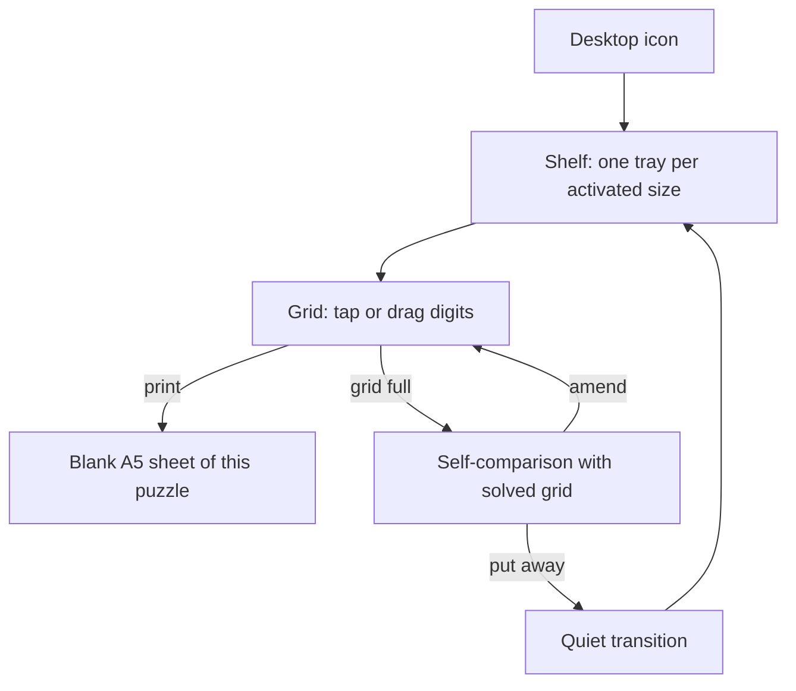
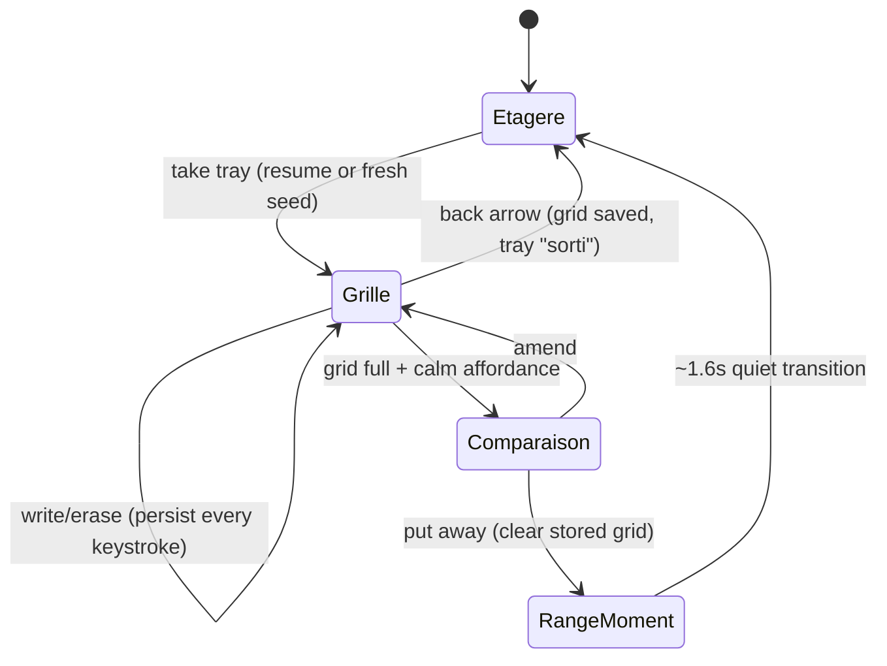
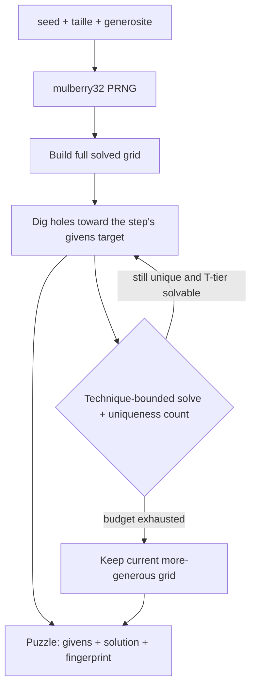
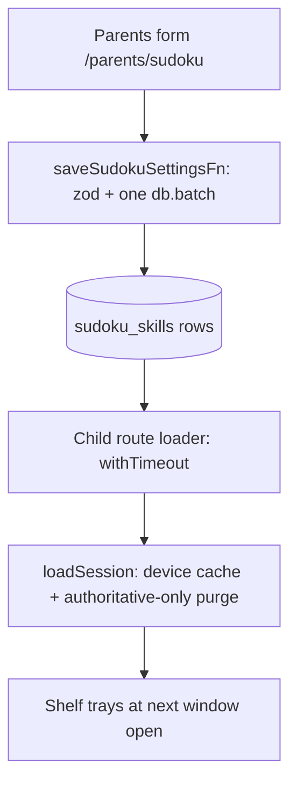

# Sudoku Mini-App - Plan

## Goal Capsule

- **Objective:** Add a fourth bureau mini-app where Arsène picks a sudoku tray by grid size, solves on screen with the calcul gestures, and prints the grid he is looking at as a blank A5 sheet.
- **Product authority:** This Product Contract, under the repo's non-negotiable calm constraint (CLAUDE.md) — no score, timer, hints-on-demand, error marking, progression, or evaluation of the child. On product behavior the R-IDs win; on implementation mechanism the KTDs win within their cited Rs.
- **Stop conditions:** Surface a blocker instead of guessing when a change would contradict a requirement, an acceptance example, or the calm constraint; when a golden must be weakened to pass; or when 9×9 generation cannot meet the KTD5 budget (that is a scope decision, not an implementation detail).
- **Open blockers:** None.

---

## Product Contract

**Product Contract preservation:** restructured and clarified, no scope change — R13 gained the user-confirmed fresh-install defaults; F3's "next time it renders" tightened to "next window open" (user-confirmed); R15 clarified that the parent page `/parents/sudoku` does appear in the ⌘K palette (parent door), only the child route never does; R16 added (user-confirmed: no child-facing discard). All original R/F/AE IDs preserved.

### Summary

A sudoku window on the bureau: a shelf of trays (one per parent-activated grid size — 4×4, 6×6, 9×9), each opening a seeded, deterministically generated puzzle whose difficulty is guaranteed calm by construction (solvable with simple human techniques, never guessing). Arsène fills cells with the gestures he already knows from calcul, compares his full grid with the solved one himself, and can print the current grid blank on A5 paper. The parent curates sizes and pre-fill generosity at a new /parents/sudoku page. The implementation mirrors the operations mini-app end to end: a pure golden-tested `src/lib/sudoku/` module, a dedicated settings table, the calcul input grammar, and the shared A5 print contract.

### Problem Frame

Arsène discovered sudoku and wants to learn and do it on his own. Nothing in kidOS covers logic puzzles today, and adult sudoku sources (9×9 books, apps with timers and error-flagging) are wrong for a beginning reader in a calm household. Parents will be nearby when he starts, so the app does not need to teach the rule in words — it needs grids sized to him, on screen and on paper.

### Key Decisions

- **Screen and paper are both first-class** (session-settled: user-directed — chosen over screen-primary or print-primary: one generator feeds an on-screen grid and a printable sheet with equal weight). Governs R12.
- **Child-visible size trays, parent-activated** (session-settled: user-directed — chosen over a single parent-set level and over free access to all sizes: extends the calcul shelf grammar; picking a tray is part of doing it on his own, and no hierarchy is ever visible). Governs R2, R13.
- **Guidance is pre-fill generosity alone** (session-settled: user-directed — chosen over an intro card and over pencil-mark notes: the design teaches; nothing else appears on the grid). Governs R6, R11.
- **Printing is child-triggered from the sudoku window** (session-settled: user-directed — chosen over parent-side printing like the operation sheets: paper autonomy is part of "on his own"). Governs R12.
- **Print produces the current grid, blank** (session-settled: user-directed — chosen over printing his entries or a fresh puzzle: paper is a fresh run at the same puzzle). Governs R12.
- **Paper is solution-free** (session-settled: user-directed — chosen over a discreet printed solution: checking stays on screen or with a parent). Governs R12.
- **Seeded generator with technique-graded difficulty, no curated bank** (session-settled: user-approved — chosen over a hand-authored puzzle bank: the uniqueness solver doubles as a difficulty guarantee, one mechanism covers all sizes, and the calcul seed idiom carries over). Governs R10, R11.
- **Digits everywhere, including 4×4** (session-settled: user-approved — chosen over symbols or colors for small grids: he already lives with digits in calcul). Governs R4.
- **A grid resumes per tray** (session-settled: user-approved — same lifecycle grammar as calcul séries). Governs R8, R16.
- **Fresh install ships 4×4 and 6×6 active, 9×9 present but off** (session-settled: user-approved — chosen over shipping 9×9 active or omitting it: the generator covers all three from day one; the parent enables 9×9 when he is ready). Governs R13.
- **An unfinished grid owns its tray** (session-settled: user-approved — chosen over a child-facing "new puzzle" escape: resume is unconditional; the parent's deactivate→reactivate is the only reset). Governs R16.

### Actors

- A1. Arsène — the child; solves, prints, and puts trays away entirely on his own after first contact.
- A2. Parent — curates which grid sizes exist and how generously each is pre-filled; is physically present for the first sessions (the app never explains the rule in words).

### Requirements

**Bureau app and shelf**

- R1. Sudoku is a fourth desktop icon, opening in the standard mini-app window with the same open/close grammar as the other apps.
- R2. The window opens on a shelf with one tray per parent-activated grid size; a non-activated size does not exist on screen (no greyed tray), and no tray carries a level, difficulty, or ranking label.
- R3. Picking a tray opens a puzzle of that size at the parent-set generosity for that size.
- R4. Cells are filled with the calcul gestures — tap a cell then tap a soft numpad, or drag a digit tile onto a cell — with pencil-like ink, never red, and digits on every size including 4×4. The numpad offers exactly the digits 1..N for the open size; writing leaves the selection in place; tapping or dropping onto a given cell changes nothing.
- R5. Given cells (the pre-filled ones) are visually distinct from the child's entries and cannot be edited.
- R6. Regions are made visible by clear thick borders; the grid carries no other guidance — no hints, no error marking, no candidate notes, no remaining-digit counters.
- R7. When the grid is full, a calm affordance lets the child lay his grid beside the solved grid and compare it himself; the app renders no verdict, praise, or error state; he can go back and amend, and putting the grid away is a quiet transition back to the shelf.
- R8. An interrupted grid resumes identically per tray on the same device; storage failure degrades silently and the child never sees an error.
- R9. A back affordance exists only inside a grid (returning the tray to the shelf); the shelf itself has none — closing the window is the way home.
- R16. An unfinished grid resumes on every tray open; no child-facing affordance discards it. Putting away a completed grid clears it; the parent's deactivate→reactivate of the size is the only other reset (per AE2).

**Puzzle generation**

- R10. Puzzles are generated by a pure, seeded, deterministic module — same seed, same puzzle — with no LLM call and no network access.
- R11. Every generated puzzle has exactly one solution and is solvable start-to-finish with simple human techniques (no guessing, no backtracking required of the child); the parent's generosity setting bounds both the number of givens and the technique tier a puzzle may demand.

**Printing**

- R12. A calm print affordance inside the grid view (including the comparison view) prints the currently open puzzle as a blank A5 sheet — the child's on-screen entries and the solution are both omitted, and the sheet carries no URL, header, or technical noise.

**Parent configuration**

- R13. A /parents/sudoku page lets the parent activate or deactivate each grid size and set a per-size generosity; at least one size always stays active. A fresh install (no rows) presents 4×4 and 6×6 active at the middle generosity and 9×9 off.
- R14. Parent settings persist across restarts and deploys; invalid or hand-edited stored settings fall back to safe values and never surface an error in the child's window.

**Shell integration**

- R15. All sudoku UI strings exist in both fr and en catalogs and pass the calm-wording scan. The child route /sudoku appears on the desktop only — never in the ⌘K palette; the parent page /parents/sudoku joins the palette like every parents section (the palette is the parent door).

### Key Flows

- F1. Solving a sudoku
  - **Trigger:** Arsène double-clicks the sudoku icon on the desktop.
  - **Steps:** Shelf shows the activated trays → he picks one → the grid opens (resumed if interrupted) → he fills cells by tap or drag → when full, the comparison affordance appears → he compares with the solved grid, amends if he wants → he puts the tray away and returns to the shelf.
  - **Covers:** R1, R2, R3, R4, R7, R8, R9, R16.
- F2. Printing for the sofa
  - **Trigger:** Arsène taps the print affordance while a grid is open.
  - **Steps:** The current puzzle prints blank on A5 → paper is a fresh run at the same puzzle → checking happens back on screen or with a parent.
  - **Covers:** R12.
- F3. Parent tunes the shelf
  - **Trigger:** Parent opens /parents/sudoku (⌘K or sidebar).
  - **Steps:** Activates or deactivates sizes and adjusts each size's generosity → the child's shelf reflects it the next time the window opens; the next fresh puzzle from a tray uses the new generosity.
  - **Covers:** R13, R14.

### Acceptance Examples

- AE1. **Covers R7.** Given a full grid containing wrong entries, when Arsène opens the comparison, then no cell is marked wrong and no verdict appears — he sees his grid and the solved grid side by side and draws his own conclusion; he can go back and amend or put the tray away as-is.
- AE2. **Covers R2, R8, R13, R16.** Given a saved in-progress grid on the 6×6 tray, when the parent deactivates 6×6, then the tray disappears from the shelf and the saved grid is purged silently; reactivating 6×6 later starts fresh.
- AE3. **Covers R12.** Given a grid where Arsène has already filled half the cells, when he prints, then the sheet shows the puzzle's givens only — his entries do not print.
- AE4. **Covers R8.** Given browser storage is unavailable, when he plays, then everything works except resume, and no error is ever shown.
- AE5. **Covers R3, R8, R13.** Given the parent lowers a size's generosity mid-week, when Arsène resumes his interrupted grid on that tray, then the saved puzzle continues unchanged; the new generosity applies from the next fresh puzzle.

### Scope Boundaries

**Deferred for later**

- Pencil marks ("petites notes" — candidate digits in cell corners), possibly for 6×6+ once he solves without them.
- Parent-side batch printing of sudoku sheets (the operations-sheet pattern).

**Deferred to Follow-Up Work**

- Per-day tray scene/phrase variants (the calcul `varianteDuJour` pattern) — the v1 shelf uses one static calm visual per size.
- Lifting `mulberry32` and the `SerieStorage` interface into a shared location if a third mini-app ever needs them; v1 imports from the operations barrel where exported and keeps sudoku otherwise self-contained.

**Outside this product's identity**

- Any in-app rule explanation, tutorial, or intro card — first contact happens with a parent beside him; the app teaches by grid shape only.
- Printed solutions in any form.
- Auto-progression, statistics, completion history, difficulty labels visible to the child — the calm constraint applies in full.

### Dependencies / Assumptions

- Parents are present for the first sessions; the app never states the rule in words (stated by the user).
- Success looks like: after a few accompanied grids, Arsène opens, solves, prints, and puts trays away with no adult in the loop (assumption extrapolated from "do it on his own").
- A household printer is reachable from the child's device when he taps print (assumption).
- Technique-graded generation stays within the KTD5 time budget at all three sizes in pure TypeScript (validated by a golden that times 9×9 generation; the uniqueness solver required by R11 is the same machinery).

---

## Planning Contract

### Key Technical Decisions

- KTD1. **New pure module `src/lib/sudoku/`, mirroring `src/lib/operations/` end to end** — a barrel `index.ts` re-exporting everything, all logic pure and golden-tested, zero imports from `~/server/*`. The generator is seeded (mulberry32 idiom), builds a full solved grid, then removes cells ("dig holes") while a technique-bounded solver keeps the puzzle uniquely solvable (session-settled: user-approved — inherits the Product Contract's generator-over-bank decision; cites R10, R11).
- KTD2. **Technique tiers define generosity.** The solver knows three human-technique tiers: T1 naked singles only, T2 adds hidden singles, T3 adds locked candidates. Uniqueness is proven separately by a bounded counting backtracker (internal machinery — the child never needs it, per R11). The parent's generosity is an integer step 1–3 per size: step 1 = T1 + the most givens, step 2 = T2 + mid givens, step 3 = T3 + the fewest givens. Givens-count ranges per (size, step) are constants in the module. Invalid stored steps clamp to 1 (per R14).
- KTD3. **Saved state carries its creation-time generosity.** The persisted grid is `{taille, seed, generosite, entries, fingerprint}` where `fingerprint` joins the givens row-major (the `fingerprintOps` idiom). Resume regenerates from `(taille, generosite, seed)` — the *saved* generosity, never the current setting — and compares fingerprints; mismatch purges silently. This implements AE5 and deliberately inverts calcul's purge-on-settings-change: a generosity change never destroys work; only size deactivation purges (AE2). Cites R8, R13.
- KTD4. **Comparison is a reversible view, not calcul's freeze.** The comparison affordance appears only when every cell is filled; entering it shows the solved grid beside his; writes stay allowed on return (AE1 — unlike calcul's `done` freeze in `writeCell`); "put away" clears the stored grid and plays the quiet ~1.6 s transition to the shelf (the `TIDIED_MOMENT_MS` idiom); the comparison state itself is not persisted — reopening resumes into the editable full grid, which offers comparison again. Cites R7, R16.
- KTD5. **Generation degrades calmly and is time-bounded.** Generation runs synchronously in a `useMemo` keyed on `(taille, generosite, seed)`. The module uses bounded dig attempts; on budget exhaustion it silently keeps the more generous grid it already has (more givens than the step's target is always acceptable); on any throw the route falls back to the shelf with no message (the `safeGenerateSerie` idiom). Target: ≤150 ms for a 9×9 at step 3 on desktop-class hardware, asserted approximately by a golden. Cites R8, R10, R11.
- KTD6. **Print renders from the givens array, never from the DOM.** The sudoku screen tree carries `no-print`; a hidden `<article class="printable-story hidden">` sheet is composed from the puzzle's givens only, so printing from the grid or the comparison view can never leak entries or the solution (AE3, R12). The child trigger is a plain `window.print()` button (the story-player idiom); no `globals.css` change is needed. Screen grid and paper grid share one pure layout/geometry module (the `layoutOperation` rule: one shape on glass and on paper). 9×9 fits A5: usable width 116 mm at 11 mm cells ≈ 99 mm.
- KTD7. **Dedicated `sudoku_skills` table, mirroring `math_skills`** — one row per activated size (`skill` key `sudoku:<taille>`, unique index, `generosite` integer, `updated_at`), not `app_settings` rows (the repo's split: key/value for global scalars, dedicated table for per-unit mini-app config). Server functions in `src/server/sudoku-functions.ts` mirror `math-functions.ts`: GET returns `settingsFromRows`-style pure normalization plus an `authoritative` flag (true only when at least one recognized row exists); POST validates with zod (`.min(1)` — at least one size, per R13 — plus dedupe and step-range refines) and saves in one `db.batch` (delete non-kept + upsert per kept size); failures return a stable code, never a sentence. Cites R13, R14.
- KTD8. **Local purge only under authority.** The session module purges a deactivated size's saved grid only when the settings read is `authoritative` — a DB outage or empty table falls back to defaults and never destroys local work (calcul's RT1 rule). Fresh-install defaults (no rows): 4×4 and 6×6 active at step 2, 9×9 off (session-settled: user-approved; cites R13, R16).
- KTD9. **Reuse the soft numpad by parameterizing it, not copying it.** `src/components/calcul/soft-numpad.tsx` gains optional props (`digits?: string[]`, `ariaErase?: string`) defaulting to current behavior; `DIGIT_TILE_CLASSES` stays single-sourced (it is the drag-ghost identity). Sudoku passes 1..N per size and its own catalog aria. Cites R4.
- KTD10. **Route and phase shape.** `src/app/_bureau/sudoku/index.tsx` (`createFileRoute("/_bureau/sudoku/")` → public URL `/sudoku/`), no `ssr:` option (golden-pinned contract). Phase is local state — `{kind:"etagere"} | {kind:"grille", taille} | {kind:"comparaison", taille} | {kind:"range", taille}` — not routes; the `range` phase mirrors calcul's `tidied` phase and renders the ~1.6 s quiet put-away moment before returning to the shelf. Loader wraps the settings fn in the `withTimeout` idiom; settings reach the child at the next window open (session-settled: user-approved — F3 semantics). The route renders a hydration-safe blank until settings and storage resolve, so its nested `DndContext` never renders during SSR; give it an explicit `id` anyway (the `fenetre.tsx` hydration note).

### High-Level Technical Design

Grid lifecycle (client, per tray):

Generation pipeline (pure module):

Settings flow (parent to child):

### Sequencing

U1 → U2 (pure module first — the goldens prove the calm guarantees before any UI exists), with U3 (server/DB) and U6 (registries + i18n, no dependencies) in parallel alongside U2 → U4 (route + components, needs U1–U3 and U6) → U5 (print, needs U1, U4) → U7 (parents page, needs U3, U6) → U8 (golden wiring + release).

---

## Implementation Units

### U1. Sudoku core: generator, solver, technique tiers

- **Goal:** The pure puzzle engine — deterministic generation with calm difficulty guaranteed by construction.
- **Requirements:** R10, R11 (KTD1, KTD2, KTD5).
- **Dependencies:** None.
- **Files:** `src/lib/sudoku/types.ts`, `src/lib/sudoku/generator.ts`, `src/lib/sudoku/solver.ts`, `src/lib/sudoku/progression.ts` (sizes, steps, givens ranges), `src/lib/sudoku/index.ts` (barrel), `src/lib/sudoku/__tests__/sudoku.golden.ts`.
- **Approach:**
  1. Types: `Taille = 4 | 6 | 9`, region geometry per size (4×4 → 2×2 boxes, 6×6 → 2×3, 9×9 → 3×3), `Puzzle {taille, generosite, seed, givens, solution, fingerprint}`.
  2. Full-grid builder: seeded shuffled backtracking fill (fast at all three sizes).
  3. Solver: T1/T2/T3 tiers per KTD2; separate bounded uniqueness counter.
  4. Dig-holes loop per KTD5 with a fixed attempt budget; fingerprint = givens joined row-major (KTD3).
  5. Reuse the mulberry32 idiom; import from `~/lib/operations` if the barrel exports it, else keep a local copy (documented deviation).
- **Patterns to follow:** `src/lib/operations/generator.ts` (seeded determinism), `src/lib/operations/progression.ts` (descriptive ladder constants), barrel discipline of `src/lib/operations/index.ts`.
- **Test scenarios:**
  - Same `(taille, generosite, seed)` → byte-identical puzzle (pin one 4×4, one 6×6, one 9×9 fixture verbatim).
  - Every generated puzzle across a seed sweep (≥50 seeds per size×step) has exactly one solution.
  - Covers AE5 (mechanism). Regenerating with the saved generosity reproduces the fingerprint; regenerating with a different generosity does not.
  - Technique bound holds: a step-1 puzzle solves with naked singles only; a step-3 puzzle never requires more than locked candidates.
  - Givens counts fall inside the (size, step) range; budget exhaustion yields a valid more-generous puzzle, never a throw.
  - 9×9 step-3 generation completes within the KTD5 budget (coarse wall-clock assertion with generous headroom for CI variance).
  - Region geometry: every row, column, and region of the solution is a permutation of 1..N for all three sizes.
- **Verification:** `bun run test:sudoku` green; fixtures pinned byte-identical.

### U2. Session lifecycle module

- **Goal:** Resume/purge/put-away behavior behind a storage port, calm under every failure.
- **Requirements:** R8, R16 (KTD3, KTD4, KTD8); AE2, AE4, AE5.
- **Dependencies:** U1.
- **Files:** `src/lib/sudoku/session.ts`, `src/lib/sudoku/settings.ts` (keys, shape guard, `settingsFromRows`-style normalization shared with U3), `src/lib/sudoku/__tests__/sudoku-session.golden.ts`.
- **Approach:**
  1. Reuse the `SerieStorage` interface from the operations barrel (three methods); wrap every access in the swallow-throws helpers (`readRaw`/`readJson`/`writeJson`/`removeKey` idiom).
  2. Keys: `sudoku:grille:<taille>` per size, `sudoku:settings` device cache.
  3. Function set mirrors `serie-session.ts`: `loadSession(storage, dbSettings)` (cache + authoritative-only purge of deactivated sizes, KTD8), `readResumableGrille` (KTD3 fingerprint check against the *saved* generosity, purge on mismatch), `shelfTrays`, `takeTray(storage, settings, taille, seed = newSeed())`, `writeCell`/`eraseCell` (given cells are guarded no-ops returning the same reference), `isGrilleComplete`, `putAway` (clear key).
  4. No freeze state — writes stay legal when complete (KTD4).
- **Patterns to follow:** `src/lib/operations/serie-session.ts` function-for-function; `src/lib/operations/settings.ts:243` (`isResumableSerie`) for the resume guard shape.
- **Test scenarios:**
  - Covers AE5. Save at step 2, lower the setting to step 1 → resume returns the saved puzzle unchanged; the next `takeTray` after put-away uses step 1.
  - Covers AE2. Authoritative settings without 6×6 → `loadSession` purges `sudoku:grille:6`; non-authoritative settings (empty/unrecognized rows) purge nothing.
  - Covers AE4. Throwing storage adapter: every function degrades silently; play state still flows in memory.
  - Corrupted/hand-edited JSON in a grid key → treated as absent, purged, no throw.
  - Write to a given cell returns the identical state reference; write to an entry cell persists on every keystroke.
  - Put-away clears exactly that size's key; other sizes' saved grids untouched.
  - Fingerprint mismatch (same seed, tampered givens) → purge and fresh puzzle.
- **Verification:** `bun run test:sudoku` green, including the failing-storage and memory adapters.

### U3. DB table, migration, and server functions

- **Goal:** Parent settings persisted per size, atomically, with calcul's authority semantics.
- **Requirements:** R13, R14 (KTD7, KTD8).
- **Dependencies:** U1 (types), parallel with U2.
- **Files:** `src/server/db/schema.ts` (add `sudoku_skills`), new migration under `drizzle/` (via `bun run db:generate` — never hand-edit `drizzle/meta/_journal.json`), `src/server/sudoku-functions.ts`, normalization logic in `src/lib/sudoku/settings.ts` (pure, golden-tested in U2's file).
- **Approach:**
  1. Table per KTD7: `id` (`generateId("sudokuskill")`), `skill` text with unique index (`sudoku:<taille>`), `generosite` integer, `updated_at` (house `nowSqlTimestamp()` convention).
  2. `getSudokuSettingsFn`: one `LIKE 'sudoku:%'` select → pure `settingsFromRows` + `authoritative` flag.
  3. `saveSudokuSettingsFn`: zod validator (known tailles, step 1–3, dedupe, `.min(1)`), one `db.batch` (delete non-kept keys + upsert per kept), returns settings in canonical size order; failures → `{success:false, code:"save-failed"}`.
- **Patterns to follow:** `src/server/math-functions.ts` (the whole file is the template), `src/server/db/schema.ts:342` (`math_skills`), migration naming from `drizzle/` (auto-slug via db:generate).
- **Test scenarios:** (pure normalization tested in U2's golden; server fns follow the untested-by-golden convention of `math-functions.ts`)
  - `settingsFromRows`: empty rows → defaults (4×4+6×6 active at step 2, 9×9 off, `authoritative: false`); one recognized row → authoritative true; unknown `skill` keys ignored; out-of-range/garbage `generosite` clamps to 1; duplicate rows resolved deterministically.
  - Zod boundary (asserted via the schema exported for the golden, if the math pattern allows; else covered by U7 manual verification): empty size list rejected; step 0/4 rejected.
- **Verification:** `bun run db:generate` produces a clean migration; `bun run test:db` still green (blank-dir boot applies the new migration); `bun run check-types`.

### U4. Child route, shelf, grid, and comparison

- **Goal:** The playable mini-app inside the bureau window.
- **Requirements:** R1–R9, R16 (KTD4, KTD5, KTD9, KTD10); AE1.
- **Dependencies:** U1, U2, U3, U6 (labels).
- **Files:** `src/app/_bureau/sudoku/index.tsx`, `src/components/sudoku/sudoku-shelf.tsx`, `src/components/sudoku/sudoku-grid.tsx`, `src/components/sudoku/comparison.tsx` (or inline), `src/components/calcul/soft-numpad.tsx` (add optional props, KTD9).
- **Approach:**
  1. Route per KTD10: loader = `withTimeout(getSudokuSettingsFn(), null)`; hydration-safe blank until settings + storage resolve; phase as local state.
  2. Shelf mirrors the calcul shell only (tray button geometry, `sorti` shift classes, whole-tray target, aria via `formatMessage`) with one static calm visual per size — a small `aria-hidden` grid glyph drawn with `palette.*` tokens; no per-day variants (deferred).
  3. Grid: droppable ids `drop-cell-<r>-<c>` with typed cell payloads (`isCellRef`-style guard), module-scope `POINTER_ACTIVATION`, `forgivingCollision`, `DragOverlay dropAnimation={null}` with the shared `DIGIT_TILE_CLASSES` ghost, the post-drag ghost-click guards (`dragJustEndedRef` + fallback timer), explicit `DndContext` id.
  4. Givens rendered distinct (weight/tint) and inert; entries ink like pencil; region borders per size geometry (R5, R6).
  5. Comparison per KTD4; put-away = `putAway` + ~1.6 s quiet moment (no button) → shelf. Back arrow only in grid/comparison phases, aria from the catalog.
- **Patterns to follow:** `src/app/_bureau/calcul/index.tsx` (loader, phases, DnD wiring, effects order, FadeIn, TidiedMoment), `src/components/calcul/tray-shelf.tsx` (shell geometry only).
- **Test scenarios:** (route/components are not golden-tested in this repo — behavior is pinned in U1/U2 goldens; this unit's scenarios are manual)
  - Covers AE1 (manual). Fill a 4×4 wrong → comparison shows both grids, nothing marked, amend works, put-away transitions quietly.
  - Manual: drag a digit onto a given cell — nothing happens, no flash; tap-write leaves selection in place.
  - Manual: close the window mid-grid, reopen — same puzzle, same entries, tray shows "sorti"; <lg viewport is fullscreen without drag.
  - Manual: deactivate a size at /parents/sudoku, reopen the child window — tray gone (AE2 end-to-end).
- **Verification:** `bun run dev`, play all three sizes; `bun run check-types && bun run lint`.

### U5. Printable sheet

- **Goal:** The blank A5 sheet, composed from givens only, triggered by the child.
- **Requirements:** R12 (KTD6); AE3.
- **Dependencies:** U1, U4.
- **Files:** `src/components/sudoku/printable-sudoku.tsx`, print button wiring in the U4 grid/comparison views; shared geometry from the same pure layout constants the screen grid uses.
- **Approach:**
  1. `<article className="printable-story hidden">` composed from `puzzle.givens` only (KTD6); mm/pt inline styles, `breakInside: "avoid"`, `Colophon` at the end, title from the catalog.
  2. Child button: `window.print()` with `Printer` icon (story-player idiom); all screen chrome under `no-print`.
  3. Cell sizing per size so 9×9 fits the 116 mm usable width (≤ ~12 mm cells), thicker region borders on paper too.
- **Patterns to follow:** `src/components/printable-operations.tsx` (geometry idiom, Colophon), `src/components/dynamic-story-player.tsx:638` (child-side trigger), `src/app/globals.css:224-292` (existing contract — no CSS change expected).
- **Test scenarios:**
  - Covers AE3 (manual print preview). Half-filled grid → sheet shows givens only; from the comparison view → same blank sheet, never the solution.
  - Manual: print preview at all three sizes fits one A5 page with no URL/header noise; ⌘K open during print stays neutralized.
- **Verification:** Print preview from dev at 4×4/6×6/9×9.

### U6. Registries, icon, and i18n catalogs

- **Goal:** The fourth icon exists in the child's grammar and every string lives in both catalogs.
- **Requirements:** R1, R15 (KTD10).
- **Dependencies:** None (needed by U4/U7 labels).
- **Files:** `src/components/bureau/apps.tsx` (`AppBureauId`, `to` union, `APPS_BUREAU` entry), `src/app/globals.css` + `src/config/style` (a fourth calm tint token — the three existing tokens are taken), `src/lib/i18n/messages/fr.ts` + `en.ts` (`bureau.apps.sudoku`, new top-level `sudoku.*`, `parents.sudoku.*`, `parents.index.sections.sudoku.*`), `src/lib/parents/sections.ts`, `src/lib/parents/pictogrammes.ts`, `src/lib/palette/entrees.ts` (+ `CHEMIN_LIBELLE` in the i18n golden).
- **Approach:**
  1. Icon: a Lucide glyph distinct from `Grid3x3` (used twice already) — e.g. `Grid2x2` or `Puzzle`; final pick at implementation.
  2. Tint: add a fourth calm hue token; do not reuse an existing token at a different opacity without checking contrast on the desktop background.
  3. Catalog copy respects the word-anchored calm scans — FR avoids `point` ("point de départ" is a trap), EN avoids `best`, `wrong`, `win`; the comparison copy especially (R7's vocabulary is "compare", never "check/correct").
  4. Type chain: the sections entry forces the palette id and path unions (`SectionParentsId`/`EntreePaletteId`/`CheminPalette`) — compile errors guide the exhaustive Records.
- **Patterns to follow:** the existing three `APPS_BUREAU` entries; `parents.index.sections.*` shape; `formatMessage` aria templates.
- **Test scenarios:** covered by extended goldens in U8 (key parity, calm scan, palette destinations); `Test expectation: none beyond U8 goldens -- registry/config unit`.
- **Verification:** `bun run check-types` (exhaustive Records force completeness); desktop shows 4 icons, dblclick + Enter open the window.

### U7. Parents configuration page

- **Goal:** The parent prepares the sudoku shelf like the calcul one.
- **Requirements:** R13, R14 (KTD7, KTD8).
- **Dependencies:** U3, U6.
- **Files:** `src/app/parents/sudoku.tsx`.
- **Approach:**
  1. Mirror `src/app/parents/calcul.tsx`: loader with `.catch(() => null)`; `settings === null` renders the SettingsUnavailable state, never an editable form; Page/Form split.
  2. One card per size: activation toggle + generosity step control (3 calm labels from the catalog, never "easy/hard"); `lastActive` disables the final toggle with the explanatory line (client mirror of the server `.min(1)`).
  3. `save()` with the saved-flag pattern so a failed `router.invalidate()` after a successful save reports the reload error, not a save error; server failure code labeled via the catalog.
- **Patterns to follow:** `src/app/parents/calcul.tsx` (the whole page is the template, minus the fiche-printing block).
- **Test scenarios:** (manual, matching the repo's convention for parents pages)
  - Deactivate down to one size → last toggle disabled with the explanatory line; server also rejects an all-off payload with a stable code.
  - Save with DB stopped → calm error line, form state preserved; reload → SettingsUnavailable, not an empty editable form.
  - Fresh install → 4×4+6×6 shown active at step 2, 9×9 off.
- **Verification:** Manual pass of the three scenarios in dev; `bun run check-types && bun run lint`.

### U8. Golden wiring, routes/i18n golden extensions, release

- **Goal:** The new surface is pinned by the test suite and shipped by the book.
- **Requirements:** R15; regression protection for R2, R10–R11, AE2/AE4/AE5.
- **Dependencies:** U1–U7.
- **Files:** `package.json` (`test:sudoku` script + append to the umbrella `test`), `src/lib/bureau/__tests__/routes.golden.ts`, `src/lib/i18n/__tests__/i18n.golden.ts`, `VERSION`, `CHANGELOG.md`, `TODOS.md` (deferred items), `CLAUDE.md` ("3 icons" → 4, commands section gains `test:sudoku`).
- **Approach:**
  1. `"test:sudoku": "bun run src/lib/sudoku/__tests__/sudoku.golden.ts && bun run src/lib/sudoku/__tests__/sudoku-session.golden.ts"`; chain into `test` — an unwired golden never runs.
  2. `routes.golden.ts`: add `/sudoku/` and `/parents/sudoku` to `URLS_PUBLIQUES`; pin `createFileRoute("/_bureau/sudoku/")`; add `/sudoku` to the mini-app prefix list guarding the palette (line ~157) so "never a shortcut into a mini-app" covers sudoku; update the parents-sections pinned ids and child count (7→8 sections, 8→9 children).
  3. `i18n.golden.ts`: `CHEMIN_LIBELLE` gains the sudoku entry (exhaustive Record); if the module exposes label tables (size names), add the byte-identity assertion vs the fr catalog.
  4. Release: bump 4-digit `VERSION`, English Keep-a-Changelog entry; note deferred items (day variants, pencil marks, batch print) in `TODOS.md`.
- **Patterns to follow:** golden script structure of `serie-session.golden.ts` (header comment, `check()`, section banners, `process.exit(1)`); existing `routes.golden.ts` assertions.
- **Test scenarios:** the goldens ARE the scenarios; plus: full `bun run test` green from a clean checkout, and `bun run test:db` proves the migration applies on a blank dir.
- **Verification:** `bun run check-types && bun run lint && bun run test` all green.

---

## Verification Contract

| Gate | Command | Proves |
|---|---|---|
| Types | `bun run check-types` | Exhaustive registry Records complete; unions widened everywhere |
| Lint | `bun run lint` | Biome/ultracite presets incl. documented opt-outs |
| Goldens | `bun run test` | All pinned behavior incl. new `test:sudoku`, extended `test:routes`/`test:i18n`, `test:db` migration boot |
| Determinism | `bun run test:sudoku` | Same seed → same puzzle; uniqueness; technique bounds; session lifecycle (AE2/AE4/AE5) |
| Manual smoke | `bun run dev` → `/sudoku` | Play all three sizes; AE1 comparison; print preview (AE3); parent round-trip at `/parents/sudoku` |

No `ssr:` option may appear under `src/app/_bureau/**` or `src/app/parents/**` (pinned by `test:routes`). The calm-wording scans in `test:i18n` and `test:operations` must pass unmodified — never weaken a scan to admit copy.

## Definition of Done

- All eight units landed in dependency order; `bun run check-types && bun run lint && bun run test` green.
- Every acceptance example demonstrably holds: AE1/AE3 by manual smoke, AE2/AE4/AE5 pinned in goldens.
- The desktop shows four icons; `/sudoku/` and `/parents/sudoku` serve; the ⌘K palette reaches the parent page and never the child app.
- Print preview from the child window yields a clean blank A5 at all three sizes with no technical noise.
- `VERSION` bumped, `CHANGELOG.md` entry written in English, deferred items recorded in `TODOS.md`, `CLAUDE.md` icon count and test list updated.
- No abandoned experimental code remains in the diff (dead generator attempts, unused components).

---

## Sources / Research

- `src/lib/operations/serie-session.ts` — storage port (3 methods), swallow-throws helpers, `loadSession`/`takeTray`/`writeCell` function set; `settings.ts:243` resume guard with fingerprint; `settings.ts:216` `safeGenerateSerie` degradation.
- `src/app/_bureau/calcul/index.tsx` — loader `withTimeout`, phase state, persist-per-keystroke effect order, DnD guards (`isCellRef`, ghost-click refs, module-scope activation constraint), `TIDIED_MOMENT_MS`.
- `src/server/math-functions.ts` + `src/server/db/schema.ts:342` — authoritative flag, one-`db.batch` save, stable error codes, `nowSqlTimestamp` convention.
- `src/app/parents/calcul.tsx` — null-guarded form, last-active disable, saved-flag reload error split, double-`requestAnimationFrame` print idiom (parent side).
- `src/components/dynamic-story-player.tsx:638` — child-side `window.print()` trigger; `src/app/globals.css:224-292` — A5 `@page`, `.no-print`, `.printable-story`, `.bureau-fenetre` print neutralization (no CSS change needed).
- `src/components/bureau/apps.tsx` — three literal unions to widen; the three tint tokens (`accent`/`secondary`/`primary`) are all taken — a fourth token is needed; `src/lib/bureau/` pure modules need zero changes for a fourth icon; nothing pins the app count.
- `src/lib/bureau/__tests__/routes.golden.ts` — `URLS_PUBLIQUES`, mini-app prefix list for the palette guard, parents-section id/count pins, `ssr:` prohibition scan.
- `src/lib/i18n/__tests__/i18n.golden.ts` — key parity, non-empty leaves, word-anchored calm scans (FR `point`, EN `best|wrong|win…` are the practical traps), `CHEMIN_LIBELLE` exhaustive Record, byte-identity label assertions.
- `src/components/calcul/soft-numpad.tsx` — calcul-coupled in exactly two spots (digit list, erase aria); `DIGIT_TILE_CLASSES` is the shared drag-ghost identity.
- Verified 2026-08-06: no sudoku or puzzle-grid code exists anywhere in the repo.
